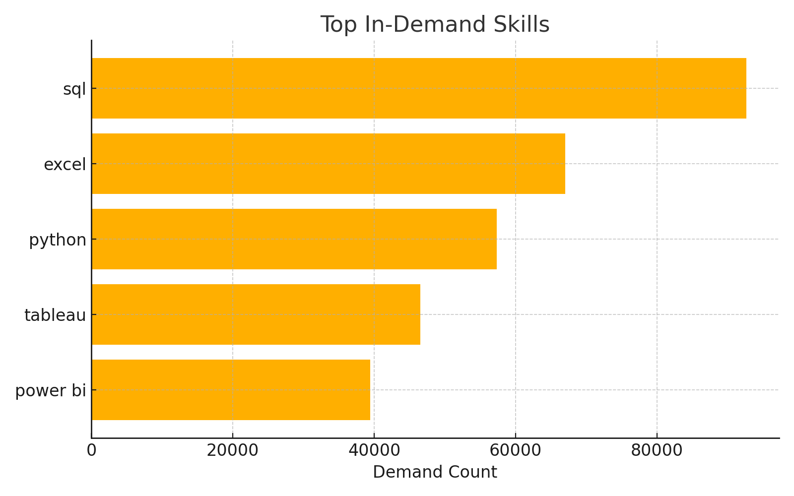
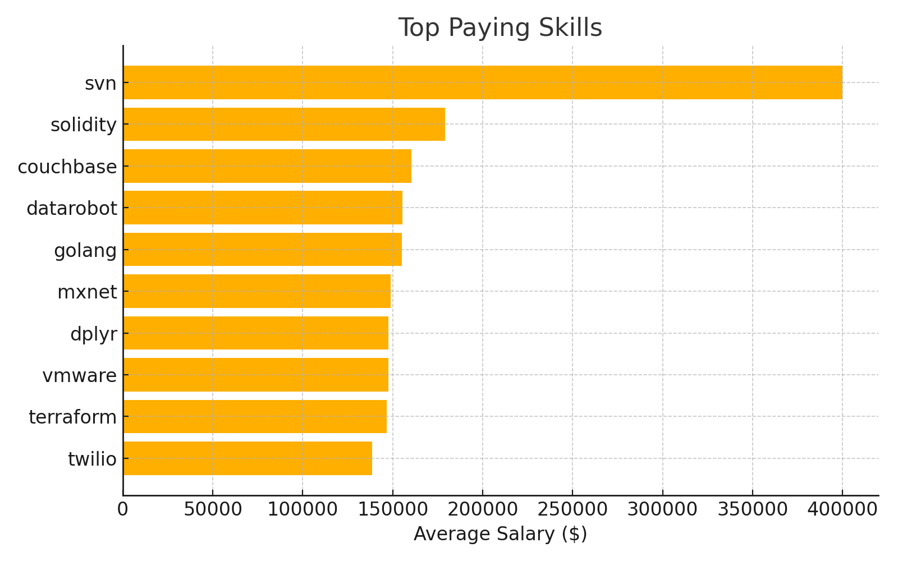
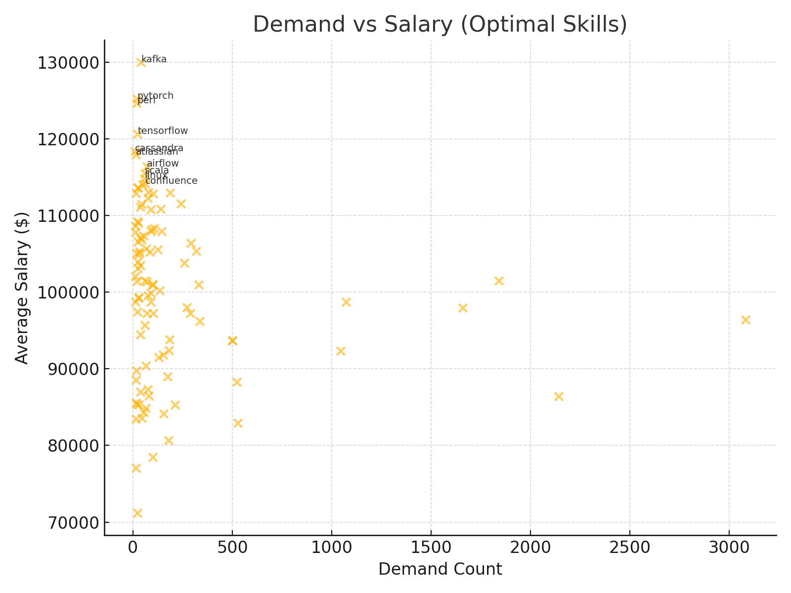
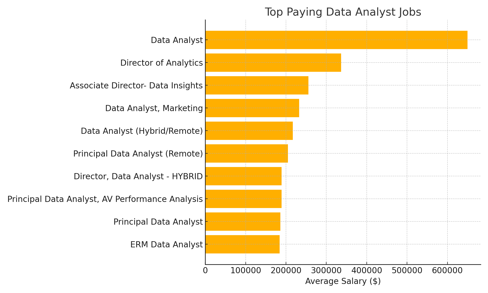

# 📊 SQL Project — Job & Skills Analysis  

## 🔍 Project Overview  
This project analyzes **Data Analyst job postings** using SQL.  
It explores:  
- Top-paying job roles  
- Skills required for those high-paying jobs  
- Most in-demand skills  
- Highest-paying skills  
- Skills that are both in-demand and high-paying (optimal skills)  

---

## 📂 Files in Repository  
- **SQL Queries**
  - `1_top_paying_jobs.sql` → Top 10 highest-paying Data Analyst jobs  
  - `2_top_paying_job_skills.sql` → Skills required for top-paying jobs  
  - `3_in-demand_skills.sql` → Most in-demand skills  
  - `top_paying_skills.sql` → Highest-paying skills by average salary  
  - `most_optimal_skills.sql` → Skills balancing demand & salary  

- **Results (JSON)**  
  - `Result_!.json` → Top-paying jobs  
  - `result_2.json` → Skills for top-paying jobs  
  - `result_3.json` → In-demand skills  
  - `result_4.json` → Optimal skills (demand + salary)  
  - `result_5.json` → Highest-paying skills  

- **Visuals (PNG)**  
  - `in_demand_skills.png`  
  - `top_paying_skills.png`  
  - `top_paying_jobs.png`  
  - `optimal_skills.png`  

---

## 📈 Visual Insights  

### 🔥 Top In-Demand Skills  
  

### 💰 Top Paying Skills  
  

### ⚡ Demand vs Salary (Optimal Skills)  
  

### 🎯 Top Paying Jobs (Preview)  
  

---

## 🧾 Key Findings  
- **Top-paying roles** include Director & Principal Data Analyst positions with salaries above \$200K+.  
- **Most in-demand skills**: SQL, Excel, Python, Tableau, Power BI.  
- **Highest-paying skills**: Solidity, Couchbase, Golang, DataRobot, TensorFlow.  
- **Optimal skills (best mix of salary & demand)**: SQL, Python, Tableau, Power BI, Snowflake, AWS, Azure.  

---

## 🛠 Tools & Technologies  
- SQL (PostgreSQL)  
- Data from job postings dataset  
- Visualizations generated with Python (Matplotlib + Pandas)  

---

## 🚀 How to Use  
1. Clone the repo:  
   ```bash
   git clone https://github.com/Pranayy01/sql_project_job_analysis.git
   cd sql_project_job_analysis
